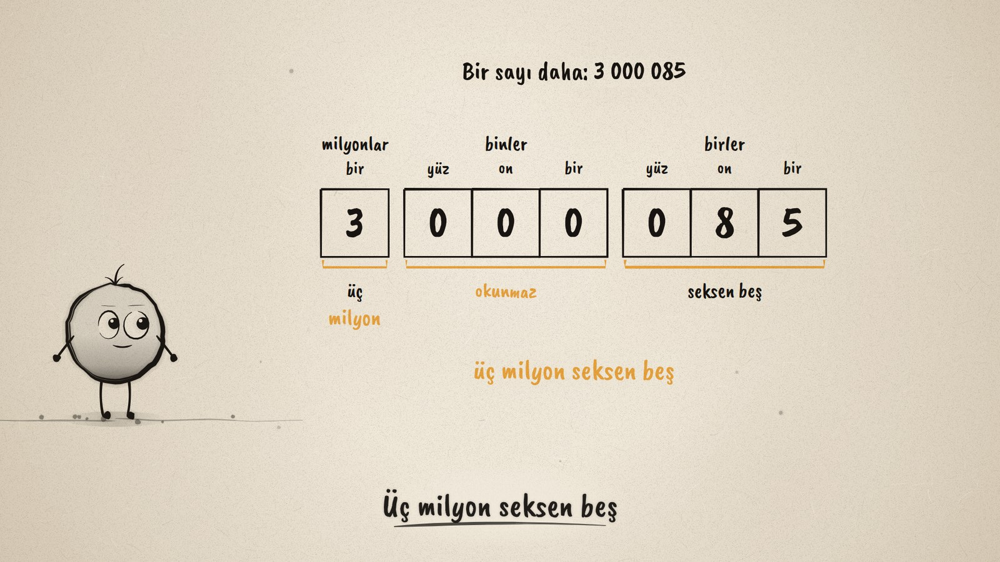
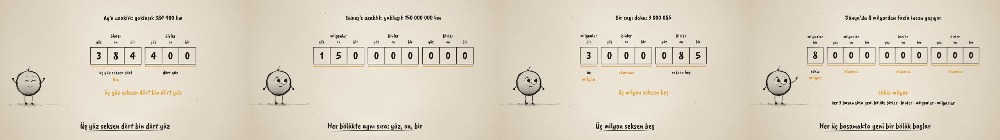

# Üçer Üçer Bölükler · Digits in Groups of Three

**▶ Tarayıcıda izleyin / Watch in the browser:** https://hakanatas.github.io/ucer-ucer-bolukler/ 
**⬇ MP4 + altyazılar / MP4 + subtitles:** [Releases](https://github.com/hakanatas/ucer-ucer-bolukler/releases) 
**✎ Kullanılan istem / The prompt behind it:** [PROMPT.md](PROMPT.md) 
**🎞 Bütün filmler / All films:** [Nokta'nın Filmleri](https://hakanatas.github.io/nokta-filmleri/?sinif=5)

> **TR —** 5. sınıf matematik "Sayılar ve Nicelikler" temasındaki MAT.5.1.1 öğrenme çıktısı için hazırlanmış, tamamen JavaScript ile çizilen 92 saniyelik mürekkep animasyonu. Günlük hayattan büyük sayılar bir basamak tablosuna yerleşiyor: Ay'a uzaklık (yaklaşık 384 400 km), Güneş'e uzaklık (yaklaşık 150 000 000 km), Dünya'daki insan sayısı (8 milyardan fazla). Basamaklar sağdan üçer üçer ayrılıyor; her bölükte aynı "yüz · on · bir" örüntüsü tekrar ediyor ve bölüğün adı söyleniyor. 3 241 123 ile 3 000 085 karşılaştırılıyor: sıfırlardan oluşan bölük okunmaz. Her üç basamakta yeni bir bölük başlıyor: birler, binler, milyonlar, milyarlar. Altyazılar Türkçe, İngilizce ya da ikisi birlikte seçilebilir.

A 92-second ink animation for **5th-grade maths**, drawn entirely with JavaScript on an HTML5 canvas. It opens the *Sayılar ve Nicelikler* theme, the first theme of the 5th-grade curriculum. Nokta, the ink character from [The Learning Ink](https://github.com/hakanatas/the-learning-ink), is the guide again. The Turkish reading of every number on screen is generated by a small function (`readTR` in `src/draw/film.js`), not typed by hand.

## Learning outcome

MEB, Türkiye Yüzyılı Maarif Modeli, Ortaokul Matematik, 5th grade, "Sayılar ve Nicelikler" theme:

**MAT.5.1.1. Altı basamaklı sayıları okuma ve yazmayı çok basamaklı sayılara genelleyebilme**
- a) Günlük hayattaki farklı bağlamlardan yola çıkarak altıdan çok basamaklı sayılar hakkında bilgi toplar.
- b) Sayıların bölükleri ile okunuşları arasındaki ortak özellikleri belirler.
- c) Sayıların bölükleri ile okunuşları arasındaki farklılıkları belirler.
- ç) Sayıların bölükleri ile okunuşları arasındaki örüntüler üzerinden basamak sayısı altıdan çok olan sayıların okunuş ve yazılışları hakkında önermelerde bulunur.

## Scenes

| # | Time | Scene | What happens | Outcome |
|---|---|---|---|---|
| 1 | 0–10 s | Büyük sayılar | 1 000, 1 000 000, 1 000 000 000. | a |
| 2 | 10–26 s | Altı basamak | Moon distance 384 400 km in a place-value table: binler and birler groups, "üç yüz seksen dört bin dört yüz". | a, b |
| 3 | 26–46 s | Milyonlar | Sun distance 150 000 000 km: a new group on the left. Every group repeats yüz · on · bir. "yüz elli milyon". | b |
| 4 | 46–64 s | Sıfırlı bölük | 3 241 123 against 3 000 085: a group of 000 is not read ("üç milyon seksen beş"). | c |
| 5 | 64–80 s | Milyarlar | More than 8 billion people: milyarlar group. A new group every three digits. | ç |
| 6 | 80–92 s | Aklında kalsın | Split in threes from the right, read each group, say its name. | ç |

## Running it

- **Preview:** double-click `index.html` (it works offline).
- **MP4:** run `npm install` once, then `npm run export -- --format=horizontal --captions=tr`.
- **Subtitles and narration:** `npm run srt` writes `out/captions_*.srt` and `narration_notes.txt`.
- **Editing:**
  - Caption text, timings and narration notes: `captions.js`
  - Everything on screen is drawn by `LI.world(t)` in `scenes/scene1.js` (the table, group readings, the full reading, the rule); the other scenes only set the camera.
  - The numbers and their contexts (`STATES`) and the Turkish reading (`read3`, `readGroup`, `readTR`): `src/draw/film.js`; layout for 16:9 and 9:16: `src/draw/kd.js`

It uses the same engine as The Learning Ink: `renderFrame(t)` as a pure function of time, seeded randomness, and frame-by-frame export.

## Lisans · License

**TR —** Bu film ve kodu [Creative Commons Atıf-GayriTicari 4.0 Uluslararası (CC BY-NC 4.0)](https://creativecommons.org/licenses/by-nc/4.0/deed.tr) lisansıyla paylaşılır. Ticari olmayan her amaçla (derste, okulda, eğitim materyalinde) kopyalayabilir, paylaşabilir ve değiştirebilirsiniz; ancak **kaynak göstermek zorunludur**: eser sahibinin adı ve bu deponun bağlantısı belirtilmeden kullanılamaz. Ticari kullanım (satış, ücretli ürün ya da yayın) için izin alınmalıdır.

**EN —** This film and its code are licensed under [Creative Commons Attribution-NonCommercial 4.0 International (CC BY-NC 4.0)](https://creativecommons.org/licenses/by-nc/4.0/). You may copy, share and adapt them for non-commercial purposes, but **attribution is required**: they may not be used without crediting the author and linking to this repository. Commercial use requires permission.

Atıf örneği / Required credit: *“Üçer Üçer Bölükler”, Hakan Ataş, Nokta'nın Filmleri — https://github.com/hakanatas/ucer-ucer-bolukler — CC BY-NC 4.0*
